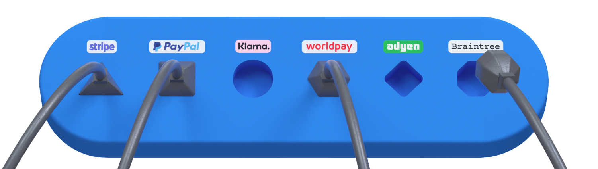

# Hyperswitch CI/CD pipeline

Deploy Hyperswitch server with CI/CD on Elestio

 
 

# Deployment

Once deployed, you can access Hyperswitch through the following link:

    https://[CI_CD_DOMAIN]/health

Ensure that your server is running by visiting the provided link.

You can open Grafana UI here:

    URL: https://[CI_CD_DOMAIN]:45150
    login: "root"
    password: [ADMIN_PASSWORD]

You can open Kafka UI here:

    URL: https://[CI_CD_DOMAIN]:7854
    login: "root"
    password: [ADMIN_PASSWORD]

# Usage

To learn more about how to use Hyperswitch and maximize its capabilities, refer to <a target="_blank" href="https://github.com/juspay/hyperswitch/blob/main/docs/try_local_system.md#try-out-our-apis">Hyperswitch tutorial</a> to learn more about.

# docker_compose.toml

You can find the file `docker_compose.toml` by following these instructions:

1. Navigate to the Tools tab.
2. Click on the VS Code button.
3. Copy the provided password.
4. Click on the Access link.
5. Paste the copied password when prompted.
6. docker_compose.toml is located at `config>docker_compose.toml`

If you want to edit this file, don't forget to do these commands:

    docker-compose down;
    docker-compose up -d;
